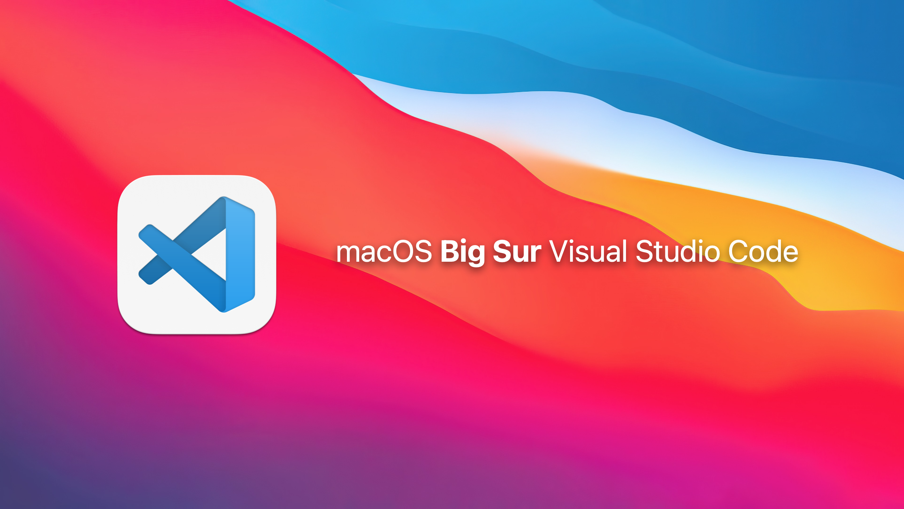
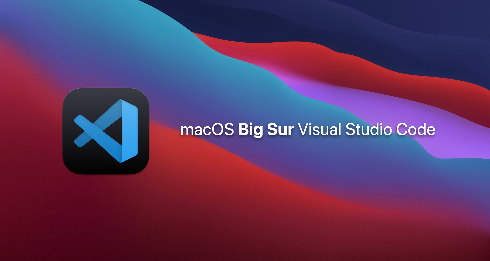

# VSC-Logo-macOS-BigSur
Visual Studio Code icon in the design of macOS Big Sur.

-----------------------------------------------
## Content
- [VSC-Logo-macOS-BigSur](#vsc-logo-macos-bigsur)
  - [Content](#content)
  - [Gallery](#gallery)
    - [Light icon](#light-icon)
    - [Dark icon](#dark-icon)
  - [How to install](#how-to-install)
  - [Manual installation](#manual-installation)
  - [License](#license)
## Gallery
### Light icon


### Dark icon


## How to install
You just have to open the Terminal, to go to the light or dark directory of the project  and to write the
following command :
```
$ bash setup.sh
```
⚠️ Save a copy of the original logo of Visual Studio Code if you want to return to the original. (location : `/Applications/Visual Studio Code.app/Contents/Resources`).

⚠️ If you install the project a second time, it will delete the original logo of Visual Studio Code.

## Manual installation
You just have to change the `Code.icns` file
located at `/Applications/Visual Studio Code.app/Contents/Resources` and replace it by the new `Code.icns` picture in the project.

-----------------------------------------------
## License
[MIT License](LICENSE)

Visual Studio Code is the property of Microsoft. All rights reserved to Microsoft.
